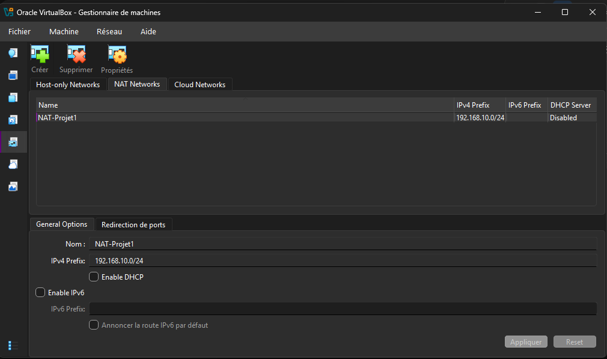
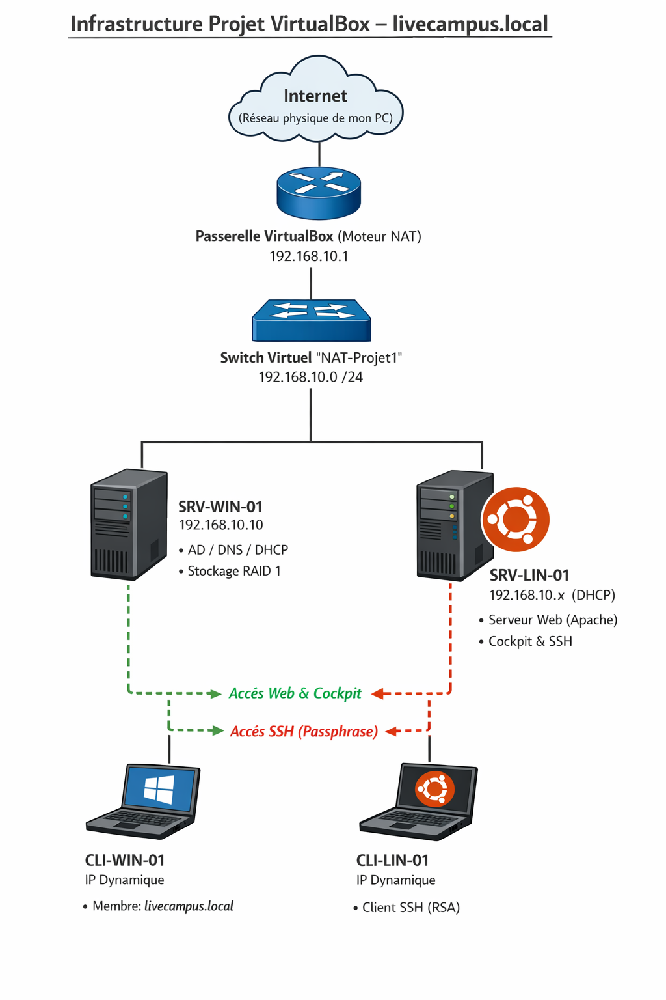

# 🌐 Mise en place d'une infrastructure multi-systèmes

**Environnement :** VirtualBox

---

## Introduction

Ce document détaille la mise en place d'une infrastructure réseau et système complète, intégrant des environnements Windows et Linux capables de communiquer entre eux. Ce projet couvre l'installation des systèmes, la configuration des services réseaux (AD, DHCP, DNS), la sécurisation des accès et la tolérance aux pannes.

---

## 1. Partie Windows

### 1.1. Préparation de l'environnement réseau (**Configuration Préalable : Le Réseau VirtualBox**)**

Avant de commencer les installations, il est nécessaire de créer un réseau virtuel (Réseau NAT ou Réseau Interne) dans VirtualBox pour s'assurer que toutes les machines pourront communiquer entre elles de manière isolée.

- J'ai créé un réseau nommé `NAT-Projet1`.
- J'ai défini la plage d'adresses IP `192.168.10.0/24`.
- J'ai désactivé le serveur DHCP intégré à VirtualBox afin d'éviter tout conflit avec le serveur Windows que je vais mettre en place.

---

### 1.2. Installation et configuration du Serveur Windows

J'ai créé une machine virtuelle (nommée `SRV-WIN-01`) et j'y ai installé Windows Server (avec Expérience de bureau). Une fois le système installé, j'ai procédé aux configurations de base indispensables avant tout déploiement de rôles :

- J'ai renommé la machine en `SRV-WIN-01`.

J'ai attribué une adresse IP statique au serveur : `192.168.10.10` (Masque : `255.255.255.0`, Passerelle : `192.168.10.1`, DNS : `127.0.0.1`).
****

### 1.3. Mise en place du Contrôleur de Domaine (AD DS)

Pour centraliser l'administration de mon infrastructure, j'ai promu ce serveur en contrôleur de domaine.

- J'ai installé le rôle **Services de domaine Active Directory** ainsi que le rôle **Serveur DNS**.
- J'ai ensuite promu le serveur pour créer une nouvelle forêt avec le nom de domaine racine `livecampus.local`.

- Après redémarrage, j'ai pu me connecter avec le compte administrateur du domaine (`LIVECAMPUS\Administrateur`).

### 1.4. Configuration du service DHCP

Afin d'automatiser l'attribution des configurations réseau aux futurs postes clients, j'ai mis en place un serveur DHCP.

- J'ai installé le rôle **Serveur DHCP** et je l'ai autorisé dans l'Active Directory.

- J'ai créé une nouvelle étendue distribuant les adresses de `192.168.10.100` à `192.168.10.150`.

- J'ai configuré les options de l'étendue pour distribuer également l'adresse de la passerelle (`192.168.10.1`).

DNS enregistrement de la zone livecampus.local
****

### 1.5. Déploiement du système client Windows et création de l'image

Pour répondre au besoin de déploiement massif, j'ai préparé une image système généralisée.

- J'ai installé un poste client vierge Windows 10 connecté au réseau `NAT-Projet1`.
- J'ai vérifié que le client recevait bien une adresse IP de mon serveur DHCP.

Vérifications coté serveur.

- J'ai ensuite utilisé l'utilitaire **Sysprep** (avec l'option "Généraliser" et arrêt du système) pour supprimer les identifiants uniques de la machine (SID).

- Enfin, depuis VirtualBox, j'ai cloné cette machine éteinte pour créer mon poste de travail définitif : `CLI-WIN-01`.

Notre Client 1 est bien sur le DHCP 

On vérifie pour confirmation depuis le serveur 

### 1.6. Intégration du client au domaine

J'ai démarré mon clone `CLI-WIN-01` et, après la phase de configuration initiale (OOBE), je l'ai intégré au domaine `livecampus.local`.

J'ai vérifié sur mon serveur dans la console "Utilisateurs et ordinateurs Active Directory" que l'objet ordinateur était bien présent.

Premier connexion au domaine depuis le client 

### 1.7. Mise en place de la tolérance aux pannes du stockage

Afin de sécuriser les données du serveur en cas de défaillance matérielle, j'ai configuré un RAID 1 (Miroir) logiciel.

- J'ai ajouté deux nouveaux disques durs virtuels de taille identique à ma VM serveur.

- Dans la console de "Gestion des disques" de Windows Server, je les ai initialisés puis j'ai créé un "Nouveau volume en miroir".

### 1.8. Création et application de Stratégies de Groupe (GPO)

Pour illustrer l'administration centralisée, j'ai mis en place des restrictions de sécurité via les GPO.

- J'ai d'abord créé une Unité d'Organisation (OU) nommée `LiveCampus_Projet`

- Dans laquelle j'ai déplacé mon ordinateur client et créé un utilisateur de test (`t.poletto`).

J'ai créé et lié une GPO à cette OU avec deux paramètres spécifiques 

1. **Configuration Ordinateur :** Affichage d'un message d'avertissement de sécurité obligatoire avant l'ouverture de session.

1. **Configuration Ordinateur :** Affichage d'un message d'avertissement de sécurité obligatoire avant l'ouverture de session.

2.**Configuration Utilisateur :** Suppression de l'icône de la Corbeille sur le bureau.

Après reconnexion sur le poste client avec l'utilisateur de test, les deux stratégies ont été appliquées avec succès.

j’ai donc redémarrer pour afficher le messages mis en amont.

---

## 2. Partie Linux

### 2.1. Déploiement du client Ubuntu et intégration à l'Active Directory

Afin d'intégrer un environnement open source à mon infrastructure Microsoft, j'ai déployé un poste client sous Ubuntu Desktop.

- J'ai créé une machine virtuelle connectée au réseau `NAT-Projet1` et j'ai procédé à l'installation standard d'Ubuntu.

- J'ai vérifié que la machine recevait bien une adresse IP dynamique de mon serveur DHCP Windows (`SRV-WIN-01`).

Pour intégrer cette machine au domaine Windows, j'ai installé les paquets nécessaires (notamment `realmd` et `sssd`).

`realm discover` pour voir si je communique bien avec la machine Windows.

- J'ai ensuite joint le domaine avec succès via la commande `realm join -U Administrateur livecampus.local`et activé la création automatique des répertoires personnels (`pam-auth-update --enable mkhomedir`).

- J'ai validé l'intégration en faisant id (`t.poletto@livecampus.local`). pour voir si je suis bien dans le domaine.

- J'ai validé l'intégration en ouvrant une session graphique avec mon compte utilisateur de l'Active Directory (`t.poletto@livecampus.local`).

### 2.2. Préparation de l'image de déploiement Linux

Tout comme pour Windows, j'ai préparé ce système pour en faire une image clonable sans générer de conflits réseau liés aux identifiants uniques.

- J'ai réinitialisé l'identifiant de la machine en vidant le fichier `/etc/machine-id` et en recréant le lien symbolique `/var/lib/dbus/machine-id`.

J'ai ensuite éteint la machine de base et j'ai généré un clone intégral (avec de nouvelles adresses MAC) nommé `CLI-LIN-01`, qui est devenu mon poste de travail Linux définitif.

### 2.3. Installation du Serveur Web Linux et de l'interface de gestion

J'ai ensuite mis en place un serveur d'applications sous Linux (nommé `SRV-LIN-01`) pour héberger un service web et démontrer l'administration à distance de l'infrastructure.

Vérification sur le DHCP 

- Après l'installation d'Ubuntu, j'ai déployé le serveur web **Apache2** et me suis assuré que le service était actif.

- J'ai testé l'accessibilité du serveur web depuis le navigateur de mon client Windows (`CLI-WIN-01`), confirmant la bonne communication inter-systèmes.

- Pour faciliter l'administration du serveur, j'ai installé l'interface de gestion web **Cockpit**.

- Je me suis connecté au tableau de bord Cockpit depuis le navigateur de mon client Windows via le port 9090 en HTTPS.

### 2.4. Sécurisation de l'accès au serveur via SSH (Clé avec Passphrase)

Pour répondre aux exigences de sécurité et prévenir les attaques par force brute, j'ai remplacé l'authentification par mot de passe du serveur Linux par une authentification par clé cryptographique.

- J'ai installé le service `openssh-server` sur mon serveur Linux `SRV-LIN-01`.

- Depuis mon client Linux `CLI-LIN-01`, j'ai généré une paire de clés RSA (`ssh-keygen`), que j'ai impérativement protégée par une **Passphrase** (phrase secrète).

- J'ai exporté la clé publique vers le serveur à l'aide de la commande `ssh-copy-id`.

- Pour verrouiller le serveur, j'ai édité le fichier de configuration `/etc/ssh/sshd_config` en modifiant la directive `PasswordAuthentication` sur `no`, puis j'ai redémarré le service SSH.

- J'ai validé la mise en place de la sécurité en me connectant en SSH depuis le client : le serveur a refusé les mots de passe et a exigé la Passphrase de ma clé pour autoriser l'accès.

---

## Infrastructure

---

## Conclusion

Ce projet m'a permis de mettre en pratique et de consolider l'ensemble des compétences attendues pour le déploiement d'une infrastructure d'entreprise hétérogène. En partant d'un environnement VirtualBox vierge, j'ai pu concevoir, installer et configurer un réseau fonctionnel où des systèmes Microsoft et Linux cohabitent et communiquent de manière sécurisée. De la gestion centralisée via Active Directory et GPO, jusqu'à la sécurisation des accès serveurs par clés cryptographiques, cette infrastructure répond pleinement aux objectifs de sécurité et d'évolutivité du cahier des charges.
